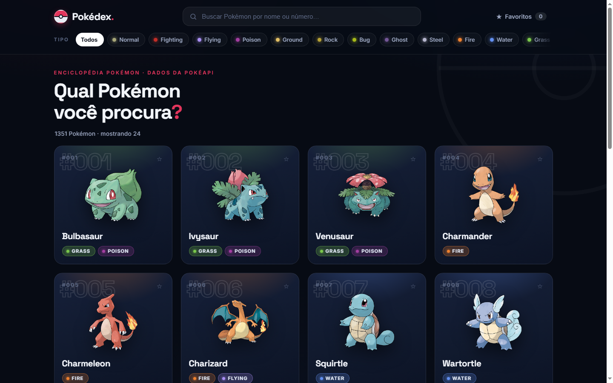
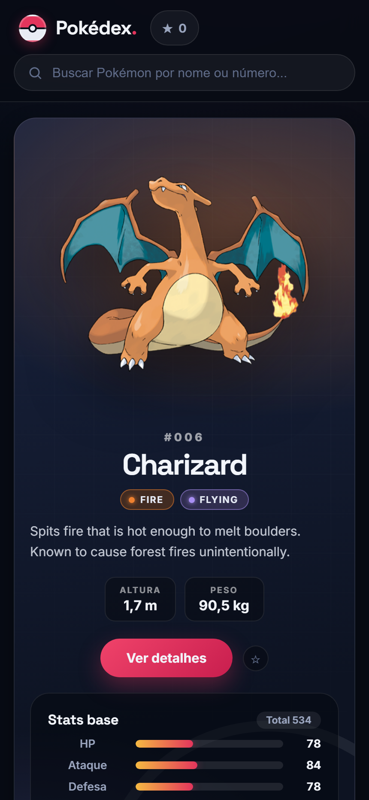
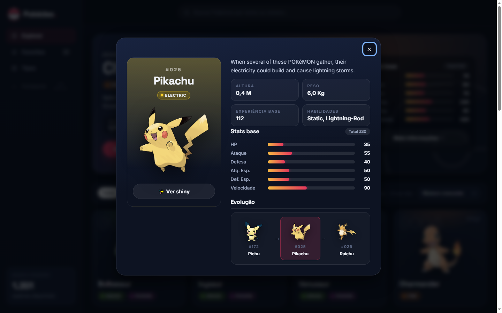

# Pokédex

> 🌐 **Demo em produção:** _cole aqui a URL do Render após o deploy_

Pokédex moderna e responsiva com dados da [PokéAPI](https://pokeapi.co). Backend em **FastAPI** que agrega e cacheia os dados, e frontend próprio (HTML + CSS + JS puro, sem build) servido pela própria API.

> Projeto iniciado durante o **#7DaysOfCode** e evoluído até um estado funcional e apresentável para portfólio.

## Screenshots

> Adicione as imagens em `docs/` com estes nomes para exibi-las aqui.

| Desktop | Mobile | Detalhes |
|---|---|---|
|  |  |  |

## Funcionalidades

- **Grade de Pokémon** com número, nome, imagem oficial e tipos
- **Busca por nome ou número** (ex: `pikachu`, `25`), com debounce
- **Filtro por tipo** (fogo, água, grama, …)
- **Detalhes completos**: descrição, altura, peso, habilidades, stats base com barras, sprite shiny
- **Cadeia evolutiva** clicável no modal (navega entre as evoluções)
- **Favoritos** persistidos em `localStorage`, com filtro "somente favoritos"
- **Carregar mais** (paginação) + deep-link `#/pokemon/25` (funciona após refresh)
- **Skeleton loading**, empty states e erros tratados com retry
- **Responsivo** (desktop e mobile) e acessível (foco visível, `aria`, `Esc` fecha o modal)

## Stack

- **Backend:** Python 3.12 · FastAPI · Uvicorn · Requests
- **Frontend:** HTML + CSS + JavaScript puro (nenhum bundler, nenhuma dependência)
- **Testes:** pytest + TestClient (`httpx`)
- **Dados:** [PokéAPI](https://pokeapi.co/api/v2)

## Arquitetura (resumo)

```text
navegador ──► FastAPI (serve /static + /api/*) ──► PokéAPI
                    │ cache em memória (TTL 1h)
                    │ listagem com buscas paralelas (8 workers)
```

```text
pokedex-api/
├── app/
│   ├── main.py        # FastAPI: rotas /api/*, rota legada e frontend estático
│   ├── pokeapi.py     # Cliente da PokéAPI (cache, timeout, erros, concorrência)
│   └── models.py      # Modelo Personagem + montadores (resumo/detalhe)
├── static/
│   ├── index.html     # SPA da Pokédex
│   ├── styles.css     # Tema escuro moderno, responsivo
│   ├── app.js         # Busca, filtros, favoritos, modal, evolução, paginação
│   └── favicon.svg
├── tests/
│   └── test_api.py    # Testes offline (HTTP mockado)
├── Dockerfile         # Deploy alternativo em container
├── render.yaml        # Blueprint do Render
└── requirements.txt
```

## Endpoints principais

| Rota | Descrição |
|---|---|
| `GET /` | Frontend da Pokédex |
| `GET /api/pokemon?limit=24&offset=0&type=fire` | Lista paginada (com imagem e tipos); `type` filtra por tipo |
| `GET /api/pokemon/{nome_ou_id}` | Detalhe: tipos, altura, peso, habilidades, stats, descrição, evoluções |
| `GET /api/types` | Tipos disponíveis |
| `GET /api/health` | Healthcheck (sem dependências externas — ideal p/ o Render) |
| `GET /personagens/{nome}` | Rota legada do Dia 1 (mantida por compatibilidade) |

Documentação interativa local: `http://127.0.0.1:8000/docs`.

## Instalação

```powershell
# Windows
py -m venv .venv
.\.venv\Scripts\Activate.ps1
pip install -r requirements.txt
```

```bash
# Linux / macOS
python3 -m venv .venv
source .venv/bin/activate
pip install -r requirements.txt
```

## Execução

```powershell
uvicorn app.main:app --reload
# abra http://127.0.0.1:8000
```

## Testes

```powershell
pytest -q
node --check static/app.js
```

## Deploy no Render

1. Suba o repositório para o GitHub.
2. No [dashboard do Render](https://dashboard.render.com), **New → Blueprint** e selecione o repositório (o `render.yaml` já configura build, start e healthcheck).
3. Ou crie manualmente: **New → Web Service**, runtime **Python**, e use:
   - **Build Command:** `pip install -r requirements.txt`
   - **Start Command:** `uvicorn app.main:app --host 0.0.0.0 --port $PORT`
   - **Health Check Path:** `/api/health`
4. Aguarde o deploy e copie a URL pública para a seção **Demo** no topo deste README.

**Variáveis de ambiente:** nenhuma obrigatória. O Render injeta `$PORT` automaticamente. `PYTHON_VERSION=3.12.6` já vai no `render.yaml`.

## Decisões técnicas

- **Sem troca de stack**: o projeto era um backend FastAPI mínimo; ele foi evoluído em vez de reescrito, e o frontend em JS puro é servido pelo próprio FastAPI — deploy único, sem build.
- **Proxy com cache**: o backend agrega PokéAPI (`/pokemon` + `/pokemon-species` + `/evolution-chain`) com cache em memória (TTL 1h) e buscas paralelas na listagem.
- **Resiliência**: timeout de 10s, 404 mapeado para "não encontrado" e falhas da PokéAPI retornam 502 com mensagem amigável. A cadeia evolutiva é opcional: se falhar, o detalhe continua funcionando sem ela.
- **Sem dependências novas no runtime**: só o que já existia (`fastapi`, `uvicorn`, `requests`); `httpx`/`pytest` entram apenas para testes.
